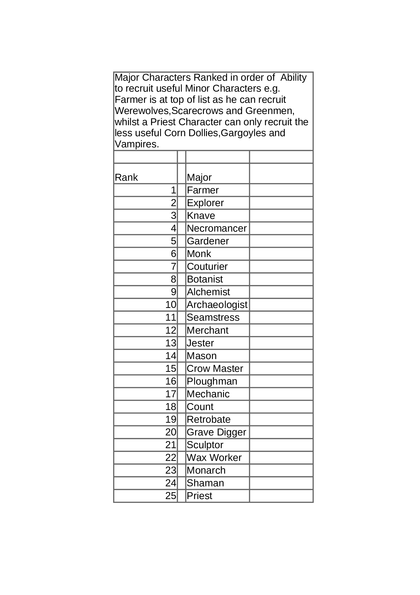

#
#
# Read me for MC_Usefulness2.png
@Tin-Rat
# Chart lists Major Characters in order of ability to recruit  
# useful minors (abilities, types and availability of Minor
# Characters taken into consideration)
#
# Listed in descending order of 'Usefulness'.

