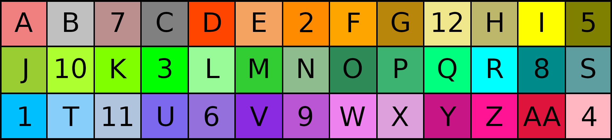

# Default Player Team Colours #

| Player No. | Colour Name   | Player No. |Colour Name    | Player No. | Colour Name   | Player No. |Colour Name    |
| :--------: | :-----------: | :--------: | :-----------: | :--------: | :-----------: | :--------: | :-----------: |
| 1          | DeepSkyBlue   | 4          | LightPink     | 7          |RosyBrown      | 10         |GreenYellow    |
| 2          | DarkOrange    | 5          | Olive         | 8          |DarkCyan       | 11         |LightSteelBlue |   
| 3          | Lime          | 6          | MediumPurple  | 9          |MediumOrchid   | 12         |Khaki          |

# Alternative Team Colours and Display Palette #
| Ref. | Colour Name   | Ref. |Colour Name    | Ref. |Colour Name    | Ref. |Colour Name    | Ref. |Colour Name    |
| :--: | :-----------: | :--: | :-----------: | :--: | :-----------: | :--: | :-----------: | :--: | :-----------: |
| A    | LightCoral    | G    | DarkGoldenRod | M    | LimeGreen     | R    | Aqua          | W    | Violet        |
| B    | Silver        | H    | DarkKhaki     | N    | DarkSeaGreen  | S    | CadetBlue     | X    | Plum          |
| C    | Gray          | I    | Yellow        | O    | SeaGreen      | T    | LightSkyBlue  | Y    |MediumVioletRed|
| D    | OrangeRed     | J    | YellowGreen   | P    | MediumSeaGreen| U    |MediumSlateBlue| Z    | DeepPink      |
| E    | SandyBrown    | K    | Chartreuse    | Q    | SpringGreen   | V    | BlueViolet    | AA   | Crimson       |
| F    | Orange        | L    | PaleGreen     |      |               |      |               |      |               |

# Recommended display and turn sheet colours for diagrams and player feedback #

