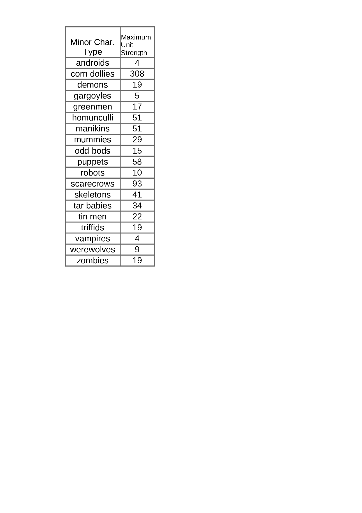

### Read me
@Tin-Rat
 
# Read me for PosseStrength.png

### Chart lists posse size numberwise -- i.e. the maximum number
### of types that can be marshalled by a Major Character of that
### particular type.
### For example; a Sculptor could marshal up to 4 Androids, 51
### Manikins and 10 robot characters. (Each Major Charcter may
### recruit up to three different types, the particular types
### that a Major Character may recruit will be sumarized in the 
### (yet unpublished) rules.)

---
