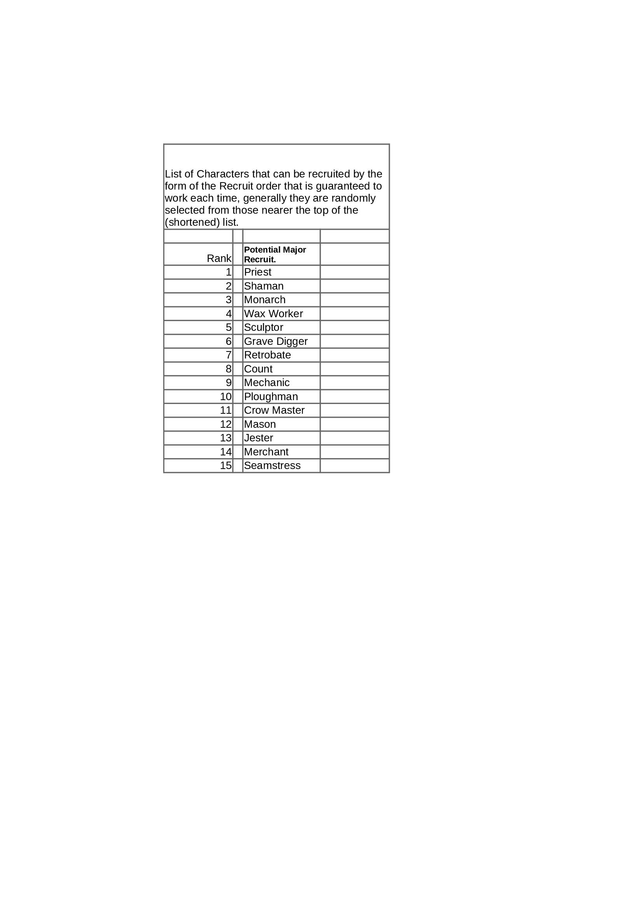

### Read me
@Tin-Rat
# 
# Read me for Short_Recruit_Order.png
#
### Short recruit order is where the recruit order does not 
### specify the preferred Major Character candidate.
### The 'long' recruit order takes the form:-
### Farmer McDuff Recruit Crow Master
#
### Whereas the 'short' form of the order takes the form:-
### Farmer McDuff Recruit

---

